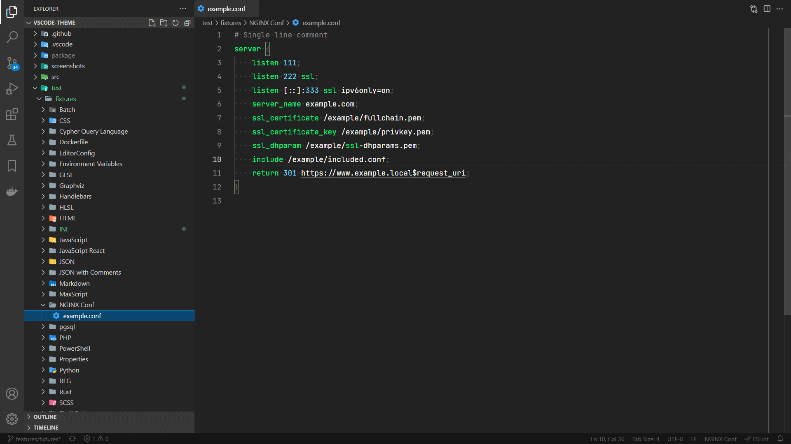
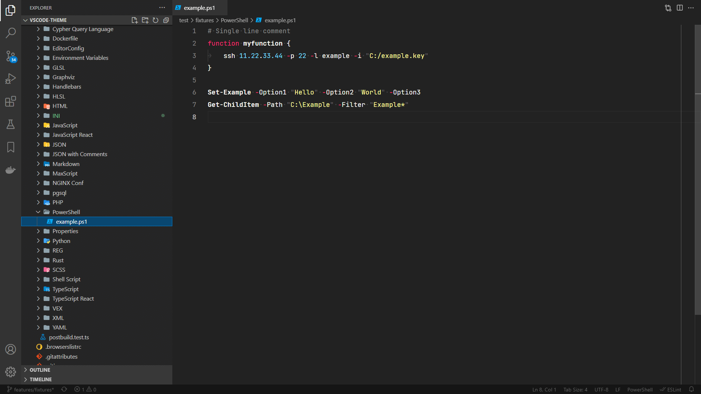
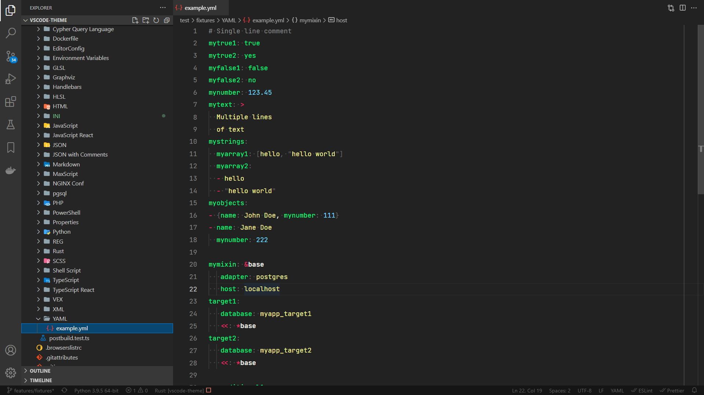

# Wildpeaks Theme

Dark theme for VSCode **focused on readability by reducing visibility of less important elements** (e.g. commas, semicolons, brackets).

| Format          | Example screenshot                                              |
| ----------------| --------------------------------------------------------------- |
| `.bat`          |                                  |
| `.css`          |                                      |
| `.conf` (Nginx) |                        |
| `.cypher`       |  |
| `.dot`          |                            |
| `Dockerfile`    |                        |
| `.editorconfig` |                    |
| `.env`          |  |
| `.glsl`         |                                    |
| `.hbs`          |                        |
| `.fx`, `.hlsl`  |                                    |
| `.html`         |                                    |
| `.ini`, `.toml` |                                      |
| `.js`, `.mjs`   |                        |
| `.jsx`          |            |
| `.json`         |                                    |
| `.jsonc`        |        |
| `.md`           |                            |
| `.ms`, `.mrc`   |                          |
| `.npmrc`        |                        |
| `.sql` (PGSQL)  |                                  |
| `.php`          |                                      |
| `.ps1`          |                        |
| `.py`           |                                |
| `.reg`          |                                      |
| `.rs`           |                                    |
| `.cscc`         |                                    |
| `.sh`           |                    |
| `.ts`           |                        |
| `.tsx`          |            |
| `.vfl`          |                                      |
| `.xml`          |                                      |
| `.yml`          |                                    |

Some file formats require additional extensions, such as:
 - `EditorConfig.editorconfig`
 - `ms-azuretools.vscode-docker`
 - `mikestead.dotenv`
 - `editorconfig.editorconfig`
 - `andrejunges.handlebars`
 - `atelierbump.language-maxscript`
 - `pkief.material-icon-theme`
 - `william-voyek.vscode-nginx`
 - `doublefint.pgsql`
 - `ionutvmi.reg`
 - `rust-lang.rust`
 - `mrmlnc.vscode-scss`
 - `slevesque.shader`
 - `jakeboone02.cypher-query-language`
 - `joaompinto.vscode-graphviz`
 - `mrmlnc.vscode-apache`
 - `melmass.vex`
